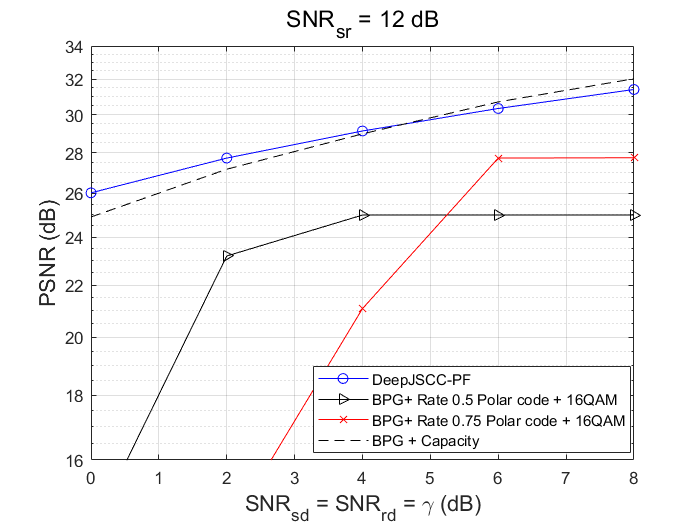

# Relay_JSCC
Source code for "Deep Joint Source-Channel Coding Over Relay Networks", [https://ieeexplore.ieee.org/abstract/document/10624800]

## Introduction
We propose three protocols for the simple cooperative relay network for the emerging semantic communications. The first two protocols, DeepJSCC-AF and DeepJSCC-DF resemeble the conventional amplify-and-forward (AF) and decode-and-forward (DF) protocols, while the third one, DeepJSCC-PF, is a simplification of DeepJSCC-DF protocol. In this conference version manuscript, we only consider the case where the source (S) node can't communicate during the relay-transmit period, the more general case (source can transmit during the entire cooperation period) will be explored in the journal version of this paper (coming soon). The system performance of the proposed scheme compared with the digital baseline is shown below.

## Dependency
- Python (3.6.9 or above)
- numpy
- pytorch 1.10.0+cu102
- compressai (pip install compressai)

## Reproduce
Type 'python run.py' to generate the results for DeepJSCC-AF and DeepJSCC-PF. For the DeepJSCC-DF, one should excute 'run_df.py'.

please alternate the parameters listed in 'get_args.py' for different scenarios. An example to train the DeepJSCC-PF model in the above figure is given below.

    cout = 12; cfeat = 256; relay_mode = 'PF'; sr_link = 12.0; sd_link = 6.0; rd_link = 6.0; adapt = True; sr_rng = 0.0; sd_rng = 4.0; rd_rng = 4.0; resume = False

The training for DeepJSCC-AF and DF are similar and set 'resume' to True when testing these model.

## Baseline

The baseline is optimistic as it always assumes the relay can perfectly decode the information from the source. With this assumption, the baseline is equivelant to the scenario where a source is transmitting to the destination using double the bandwidth. See the manuscript for more details.

## Discussion
We discuss more about the DeepJSCC-DF protocol. A key issue for the semantic communication is that, unlike digital schemes which employ modern channel codes (e.g., Polar, LDPC, turbo codes) for forward error correction, it can't 'decode' (i.e., clear all the noise) at the relay. Even though the DeepJSCC-DF protocol recovers the image and re-encodes it, it is still effected by the noise between the source (S) and the relay (R), that's why when $SNR_{sr} = 12$ dB, the DeepJSCC-DF can only outperform AF by a small margin. Further efforts are needed to improve the gain of DeepJSCC-DF over AF which will be shown in our journal version.
